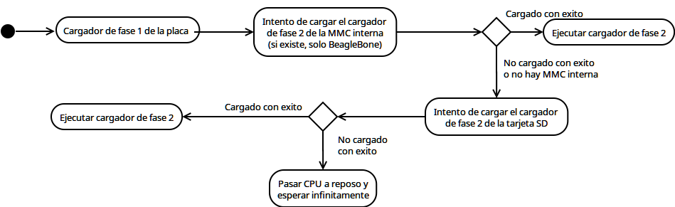

### {.plain}
\begin{tabularx}{\textwidth}{p{0.25\textwidth}X}
$\vcenter{\includegraphics[width=\linewidth,height=0.20000\textheight,keepaspectratio]{images/us_logo.jpg}}$ &
$\vcenter{
\centering
\includegraphics[width=\linewidth,height=0.20000\textheight,keepaspectratio]{images/atc_logo.png}
}$
\end{tabularx}
\vspace{-0.25cm}
\begin{center}
\includegraphics[width=\linewidth,height=0.07000\textheight,keepaspectratio]{images/etsii_logo.png}
\end{center}
\vspace{-0.4cm}
\begin{center}
\bf
Migración del sistema operativo TinyCore y el software Docker a la placa computadora BeagleBoard
\end{center}

\vfill

\begingroup
\small
\hfill Autor: Alejandro Ojeda Gutiérrez

\hfill Tutor: Daniel Cagigas Muñiz

\hfill Septiembre, 2016

\endgroup

### Índice

\footnotesize
\tableofcontents

# Objetivos
### \secname

- Adaptar y compilar TinyCore para:
    - BeagleBoard-xM
    - BeagleBone Black

- Compilar y pre-instalar Docker.
- Documentar como crear contenedores Docker para el dispositivo.

# Tecnologías utilizadas
### \secname

- BeagleBoard xM y BeagleBone Black

\centerline{\includegraphics{images/beagleboard_xm.jpg}}

### \secname

- TinyCore

\centerline{\includegraphics{images/logo_tinycore.png}}

### \secname

- Docker

\centerline{\includegraphics{images/docker_logo.png}}

### \secname

- Otras tecnologías, incluyendo:
    - Crosstool-NG
    - U-Boot
    - EGLibC
    - UDev
    - BusyBox

# Dedicación y costes

## Dedicación

### \subsecname

- Se han empleado unas 136 horas en el proyecto.

### \subsecname

\begin{centering}
\includegraphics[width=\textwidth,height=0.8\textheight,keepaspectratio]{images/hours_chart.png}
\end{centering}

## Coste económico
### \subsecname

- Coste económico de los materiales:

| Articulo                         | Coste |
|----------------------------------+------:|
| BeagleBoard-xM                   |  150€ |
| BeagleBone Black                 |   30€ |
| Cable USB OTG                    |    5€ |
| Cable MiniHDMI                   |   10€ |
| Tarjeta SD                       |    5€ |
| Fuente de alimentación universal |   15€ |
| **SUBTOTAL**                     |  215€ |

### \subsecname

- Coste económico de la mano de obra:
    - (suponiendo 8€/h) 1088€

- **TOTAL**: 1303€

# Diseño

## BeagleBoard y Linux
### \subsecname

- Placa computadora de arquitectura ARM.

- Uso mucho menos común que un ordenador corriente.
    - Soporte menor en la rama principal de Linux.

- Necesario aplicar parches de otros repositorios.

## Compilación cruzada
### \subsecname

- Un compilador de C para Linux esta dirigido a:
    - Una arquitectura.
    - Una librería de C.

- La arquitectura objetivo es diferente:
    - Las placas usan ARM.
    - Un ordenador típico usa x86_64.

### \subsecname

- Por tanto, es necesario construir un compilador cruzado.

- Construir un compilador cruzado es un proceso complejo.
    - Hay dependencias circulares entre los componentes.

- Para automatizar esta tarea, se utilizará una herramienta llamada Crosstool-NG.

## El proceso de arranque
### \subsecname

- Las placas utilizan el cargador de arranque U-Boot.

- U-Boot esta dividido en dos fases.

### \subsecname

- La primera fase viene de serie con la placa.
    - No se puede modificar ya que viene escrita en una ROM.
    - Es mínima: su único objetivo es cargar la segunda fase.

- Primero intenta buscar y arrancar de la memoria interna.
- Si no lo consigue, intenta arrancar de la tarjeta SD.

### \subsecname

- El orden puede invertirse pulsando un botón.

\ 

### \subsecname

- La segunda fase se instala con el sistema operativo.

- Su propósito es cargar:
    - El kernel de Linux.
    - Los parámetros de arranque del kernel.
    - El árbol de dispositivo (dtb).
    - El sistema de archivos inicial (initramfs)

## Librería de C
### \subsecname

- Todos los binarios enlazados dinámicamente dependen de un programa cargador
proporcionado por la librería de C.

- Cuando se solicita ejecutar un binario, Linux busca y utiliza este cargador
para cargar en memoria el binario y todo su árbol de dependencias.

### \subsecname

- Dado que prácticamente todos los programas hacen uso de la librería de C, es
fundamental tener una instalada.

- En este proyecto se ha utilizado EGLibC, que es de las mas compatibles.

## Detección de dispositivos
### \subsecname

- La detección de dispositivos en Linux esta implementada por un servidor
llamado UDev.

- UDev recibe del kernel los eventos relacionados con los dispositivos que se
van conectando y carga los módulos necesarios para su funcionamiento.

- Instalar UDev es necesario para poder utilizar dispositivos como un modulo
WiFi o un teclado inalámbrico.

## Interprete de comandos
### \subsecname

- BusyBox es un programa diseñado para uso en dispositivos empotrados que
ademas de cumplir la función de interprete de comandos, implementa la
funcionalidad de muchos otros paquetes de software.

- TinyCore utiliza a BusyBox como interprete de comandos.

## Docker
### \subsecname

- Docker es un sistema de gestión de contenedores que facilita el despliegue de
software y mitiga problemas de dependencias, diferencias de versiones de
librerías...

- Un contenedor es una imagen que contiene un determinado software así como
todos los paquetes y librerías necesarias para su ejecución.

### \subsecname

Docker:

- Aisla el sistema de archivos del contenedor del de su anfitrión utilizando
`chroot`.

- Aisla el espacio de procesos del contenedor utilizando los llamados
`PID namespaces`.

### \subsecname

Docker:

- Limita el uso de recursos del contenedor utilizando `control groups`.

- Aisla y controla el uso de red del contenedor utilizando `network namespaces`
y `netfilter`.

### \subsecname

- La función de Docker es orquestar todas estas tecnologías del kernel para
que usar un contenedor sea rápido y fácil.

- Ademas, Docker proporciona un sistema en la nube para compartir imágenes y
contenedores que esta integrado con la aplicación.

# Conclusiones
### \secname

Ventajas:

- Podemos cargar contenedores fácilmente en la BeagleBoard.

- Dichos contenedores pueden usar cualquier combinación de librerías, etc,
sin necesidad de modificar el sistema operativo.

### \secname

Inconvenientes:

- Problemas de rendimiento a la hora de descargar de la nube y construir
contenedores.

- Se recomienda realizar dichas tareas en una máquina virtual ARM.

- Una vez desplegado el contenedor, el rendimiento es muy bueno.

# Demo
### Demo
\vfill
\begin{center}
\huge
Demo
\end{center}
\vfill

# Q&A
### Q&A
\vfill
\begin{center}
\huge
Q\&A
\end{center}
\vfill

<!-- vim: set et ts=4 sw=4 spell spelllang=es: -->
